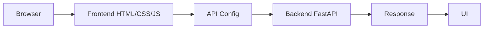

# Frontend Architecture

## Краткое описание

CarDiagnostic AI frontend - статический frontend-проект для сайта PULS. Он состоит из HTML-страниц, CSS-стилей и JavaScript-модулей, которые управляют интерфейсом, навигацией, авторизацией, Supabase-клиентом и запросами к backend FastAPI.

## Структура папок

```text
- cardiagnostic-ai-github/
  - .nojekyll
  - ARCHITECTURE_FRONTEND.md
  - CNAME
  - FRONTEND_CODEX_RULES.md
  - FRONTEND_TASK_LOG.md
  - README.md
  - assets/
    - css/
      - style.css
    - img/
      - puls-logo.png
    - js/
      - api.js
      - app.js
      - auth.js
      - config.js
      - router.js
      - supabaseClient.js
    - pages/
      - car.js
      - dtc.js
      - history.js
      - login.js
      - manuals.js
      - profile.js
      - puls.js
      - service.js
      - settings.js
      - subscription.js
      - videos.js
  - index.html
  - pages/
    - about.html
    - privacy.html
    - terms.html
  - robots.txt
  - scripts/
    - generate_frontend_architecture.py
  - serve.mjs
  - server.js
  - sitemap.xml
```

## HTML-страницы

- `index.html`
- `pages/about.html`
- `pages/privacy.html`
- `pages/terms.html`

## CSS-файлы

- `assets/css/style.css`

## JavaScript-файлы

- `assets/js/api.js`
- `assets/js/app.js`
- `assets/js/auth.js`
- `assets/js/config.js`
- `assets/js/router.js`
- `assets/js/supabaseClient.js`
- `assets/pages/car.js`
- `assets/pages/dtc.js`
- `assets/pages/history.js`
- `assets/pages/login.js`
- `assets/pages/manuals.js`
- `assets/pages/profile.js`
- `assets/pages/puls.js`
- `assets/pages/service.js`
- `assets/pages/settings.js`
- `assets/pages/subscription.js`
- `assets/pages/videos.js`
- `serve.mjs`
- `server.js`

## Pages

- `pages/about.html`
- `pages/privacy.html`
- `pages/terms.html`

## Assets

- `assets/css/style.css`
- `assets/img/puls-logo.png`
- `assets/js/api.js`
- `assets/js/app.js`
- `assets/js/auth.js`
- `assets/js/config.js`
- `assets/js/router.js`
- `assets/js/supabaseClient.js`
- `assets/pages/car.js`
- `assets/pages/dtc.js`
- `assets/pages/history.js`
- `assets/pages/login.js`
- `assets/pages/manuals.js`
- `assets/pages/profile.js`
- `assets/pages/puls.js`
- `assets/pages/service.js`
- `assets/pages/settings.js`
- `assets/pages/subscription.js`
- `assets/pages/videos.js`

## API-вызовы к backend

- `assets/js/api.js:4` - /history?userId=${encodeURIComponent(userId, fetch(...) - `const res = await fetch(`${API_BASE_URL}/api/history?userId=${encodeURIComponent(userId)}`);`
- `assets/js/api.js:11` - /history`,, fetch(...) - `const res = await fetch(`${API_BASE_URL}/api/history`, {`
- `assets/js/api.js:22` - /chat`,, fetch(...) - `const res = await fetch(`${API_BASE_URL}/api/chat`, {`
- `assets/js/app.js:2` - /chat`; - `const CHAT_API_URL = PULS_CONFIG.CHAT_API_URL || `${String(PULS_CONFIG.API_BASE_URL || "https://puls-backend-t3sn.onrender.com").replace(/\/$/, "")}/chat`;`
- `assets/js/app.js:741` - fetch(...) - `const response = await fetch(`${VIN_LOOKUP_URL}${encodeURIComponent(normalizedVin)}?format=json`);`
- `assets/js/app.js:1897` - fetch(...) - `const res = await fetch(CHAT_API_URL, {`
- `assets/js/app.js:1938` - /chat - `console.error("PULS /chat request failed:", error);`
- `assets/js/config.js:3` - https://puls-backend-t3sn.onrender.com/chat - `CHAT_API_URL: "https://puls-backend-t3sn.onrender.com/chat",`
- `server.js:191` - fetch(...) - `const response = await fetch(webhookUrl, {`
- `server.js:220` - /health - `app.get("/api/health", asyncRoute(async (req, res) => {`
- `server.js:226` - /history - `app.get("/api/history", asyncRoute(async (req, res) => {`
- `server.js:242` - /history - `app.post("/api/history", asyncRoute(async (req, res) => {`
- `server.js:266` - /chat - `app.post("/api/chat", asyncRoute(async (req, res) => {`

## Использование Supabase

- `assets/js/supabaseClient.js:11` - createClient - `window.supabaseClient = window.supabase.createClient(SUPABASE_URL, SUPABASE_ANON_KEY);`

## Поток frontend-запроса


