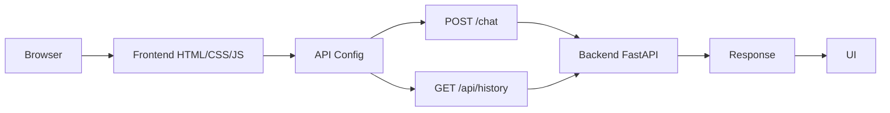

# Frontend Architecture

## Краткое описание

CarDiagnostic AI frontend - статический frontend-проект для сайта PULS. Он состоит из HTML-страниц, CSS-стилей и JavaScript-модулей, которые управляют интерфейсом, навигацией, авторизацией, Supabase-клиентом и запросами к backend FastAPI.

Frontend не принимает диагностические решения и не пишет `diagnostic_requests` напрямую. Чат отправляет сообщения в backend `/chat`, история читается из backend `/api/history`, а quota берется из ответа backend. Для незалогиненного пользователя используется локальный `web-guest-* auth_user_id`, чтобы кнопка отправки и Enter всегда доходили до backend; после Supabase Auth используется настоящий `auth_user_id`.

## Структура папок

```text
- cardiagnostic-ai-github/
  - .nojekyll
  - ARCHITECTURE_FRONTEND.md
  - CNAME
  - FRONTEND_CODEX_RULES.md
  - FRONTEND_TASK_LOG.md
  - README.md
  - assets/
    - css/
      - style.css
    - img/
      - puls-logo.png
    - js/
      - api.js
      - app.js
      - auth.js
      - config.js
      - router.js
      - supabaseClient.js
    - pages/
      - car.js
      - dtc.js
      - history.js
      - login.js
      - manuals.js
      - profile.js
      - puls.js
      - service.js
      - settings.js
      - subscription.js
      - videos.js
  - index.html
  - pages/
    - about.html
    - privacy.html
    - terms.html
  - robots.txt
  - scripts/
    - generate_frontend_architecture.py
  - serve.mjs
  - server.js
  - sitemap.xml
```

## HTML-страницы

- `index.html`
- `pages/about.html`
- `pages/privacy.html`
- `pages/terms.html`

## CSS-файлы

- `assets/css/style.css`

## JavaScript-файлы

- `assets/js/api.js`
- `assets/js/app.js`
- `assets/js/auth.js`
- `assets/js/config.js`
- `assets/js/router.js`
- `assets/js/supabaseClient.js`
- `assets/pages/car.js`
- `assets/pages/dtc.js`
- `assets/pages/history.js`
- `assets/pages/login.js`
- `assets/pages/manuals.js`
- `assets/pages/profile.js`
- `assets/pages/puls.js`
- `assets/pages/service.js`
- `assets/pages/settings.js`
- `assets/pages/subscription.js`
- `assets/pages/videos.js`
- `serve.mjs`
- `server.js`

## Pages

- `pages/about.html`
- `pages/privacy.html`
- `pages/terms.html`

## Assets

- `assets/css/style.css`
- `assets/img/puls-logo.png`
- `assets/js/api.js`
- `assets/js/app.js`
- `assets/js/auth.js`
- `assets/js/config.js`
- `assets/js/router.js`
- `assets/js/supabaseClient.js`
- `assets/pages/car.js`
- `assets/pages/dtc.js`
- `assets/pages/history.js`
- `assets/pages/login.js`
- `assets/pages/manuals.js`
- `assets/pages/profile.js`
- `assets/pages/puls.js`
- `assets/pages/service.js`
- `assets/pages/settings.js`
- `assets/pages/subscription.js`
- `assets/pages/videos.js`

## API-вызовы к backend

- `assets/js/api.js` - `GET /api/history?user_id=...`
- `assets/js/api.js` - `POST /chat`
- `assets/js/app.js:2` - /chat`; - `const CHAT_API_URL = PULS_CONFIG.CHAT_API_URL || `${String(PULS_CONFIG.API_BASE_URL || "https://puls-backend-t3sn.onrender.com").replace(/\/$/, "")}/chat`;`
- `assets/js/app.js` - `POST /chat` через `CHAT_API_URL`
- `assets/js/app.js` - `GET /api/history?user_id=...`
- `assets/js/app.js` - quota отображается из `data.quota`
- `assets/js/config.js:3` - https://puls-backend-t3sn.onrender.com/chat - `CHAT_API_URL: "https://puls-backend-t3sn.onrender.com/chat",`
- `assets/js/config.js` - on `localhost` / `127.0.0.1` frontend switches to same-origin `/api/chat` and `/api/history`; production still calls Render backend directly
- `server.js` - локальный dev proxy: `/api/health`, `/api/history`, `/api/chat` проксируются в backend без прямой записи в Supabase
- `serve.mjs` - lightweight local preview server with the same `/api/health`, `/api/history`, `/api/chat` proxy behavior for CORS-safe localhost checks

## Использование Supabase

- `assets/js/supabaseClient.js:11` - createClient - `window.supabaseClient = window.supabase.createClient(SUPABASE_URL, SUPABASE_ANON_KEY);`
- Supabase на frontend используется только для Auth и базового `users` profile sync. Frontend не читает и не пишет legacy runtime-поля `users.requests_left`, `users.conversation_history`, `users.car_info`; quota и история приходят из backend.

## Поток frontend-запроса



## Vehicle Cards

- `assets/js/app.js` syncs "My car" through backend `GET/POST/PUT/DELETE /api/vehicles`.
- LocalStorage remains a UI cache/fallback, but after login Supabase `vehicles` through backend is the source of truth.
- Vehicle LocalStorage is scoped by the authenticated user id. Guest mode does not read the previous shared vehicle cache, so logout + refresh cannot show another user's saved cars.
- Car photos are uploaded to Supabase Storage `vehicle-photos`; frontend stores the public URL in `photo_url` and shows replace/delete actions from the dedicated photo menu.
- Technical spec fields (`displacement`, `power`, `torque`, `engineType`, `cylinders`, `emissions`, `tank`) are editable in the UI and persist through `/api/vehicles`.
- The specs card has a dedicated "Load from internet" button that reuses the existing official NHTSA vPIC VIN lookup flow, fills the spec inputs, and saves them through the normal vehicle sync path.
- The active vehicle label is sent to `/chat` as `car_info` so backend can resolve `vehicles.id`.
- Frontend does not send `conversation_history` to `/chat`; backend восстанавливает контекст сам из `conversations/messages/diagnostic_requests`.
- If the user deletes a car, frontend removes the personal card; confirmed solved cases remain in backend shared knowledge/history.

## Auth And Private Data

- Request history and journal views read backend `/api/history` only for a signed-in user.
- Guest mode returns empty private lists instead of falling back to old browser LocalStorage history.
- On `puls-auth-change` logout, frontend clears legacy private UI cache keys for history and vehicles before rerendering the app.
