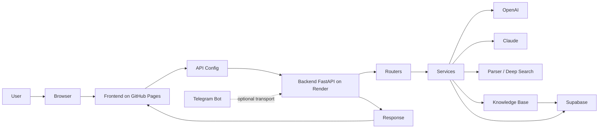

# PROJECT OVERVIEW

## 1. Описание проекта

PULS - это AI-система для автомобильной диагностики, которая помогает пользователю описать проблему, уточнить контекст автомобиля, найти похожие реальные случаи и получить понятный список проверок.

Назначение системы - объединить интерфейс сайта, backend API, AI-маршрутизацию, парсер автомобильных форумов, базу знаний и историю обращений. PULS решает задачи первичной диагностики, поиска информации по форумам и базе знаний, подготовки ответа пользователю и сохранения полезных данных для дальнейшего развития сервиса.

Основные технологии проекта:

- Frontend: HTML, CSS, JavaScript, GitHub Pages.
- Backend: Python, FastAPI, Pydantic, Uvicorn.
- Data: Supabase.
- AI: OpenAI, Claude.
- Hosting: Render для backend, GitHub Pages для frontend.
- Дополнительные интеграции: Telegram Bot, parser/search pipeline.

---

## 2. Общая архитектура

Система состоит из нескольких связанных компонентов:

- Frontend отвечает за интерфейс сайта, страницы, ввод пользователя, отображение ответа и вызовы backend API.
- Backend принимает API-запросы, маршрутизирует диалог, запускает AI, parser, knowledge base и работу с Supabase.
- Supabase хранит пользователей, историю запросов, базу знаний и связанные диагностические данные.
- OpenAI используется для AI-маршрутизации, генерации ответов и вспомогательных AI-задач.
- Claude используется для глубокого поиска и анализа через cloud/search-ветку.
- Telegram Bot исторически был отдельным транспортом для сообщений, но для сайта не должен мешать web-flow.
- GitHub Pages публикует frontend.
- Render запускает backend FastAPI.

---

## 3. Репозитории проекта

### Backend

`puls-backend`

Назначение:

- FastAPI backend.
- API для сайта и интеграций.
- AI-логика и маршрутизация диалога.
- Parser и deep search.
- Knowledge Base.
- Supabase-интеграция.

### Frontend

`cardiagnostic-ai`

Назначение:

- Интерфейс сайта.
- HTML-страницы.
- JavaScript-логика.
- Работа с backend API.
- Авторизация.
- UI и клиентские состояния.

---

## 4. Backend Architecture

Подробная архитектура backend находится в:

`ARCHITECTURE.md`

Ключевые части backend:

- routers - API endpoints и маршруты FastAPI.
- services - бизнес-логика, AI, parser, formatter, users, history.
- schemas - Pydantic-схемы запросов и ответов.
- database - Supabase client и работа с базой.
- prompts - системные инструкции и prompt-файлы.
- parser - поиск и анализ внешних источников.
- knowledge base - сохранение и поиск полезных диагностических кейсов.

---

## 5. Frontend Architecture

Подробная архитектура frontend находится в:

`ARCHITECTURE_FRONTEND.md`

Ключевые части frontend:

- страницы - основные HTML-страницы и разделы сайта.
- JavaScript - логика интерфейса, роутинг, API, auth, state.
- assets - стили, изображения и клиентские модули.
- api - вызовы backend FastAPI.
- стили - визуальная система сайта.
- взаимодействие с backend - отправка сообщений, получение ответов, история, авторизация.

---

## 6. Правила разработки

Всегда соблюдать следующие правила:

- Не изменять рабочий код без необходимости.
- Изменять только файлы, относящиеся к задаче.
- Не выполнять массовый рефакторинг без отдельного разрешения.
- Не создавать дублирующий функционал.
- Использовать существующую архитектуру.
- Не ломать взаимодействие frontend и backend.
- Перед созданием новых сервисов проверить существующие.

---

## 7. Документация проекта

Backend:

- `ARCHITECTURE.md` - карта backend: структура `app`, routers, services, schemas, database, зависимости, Supabase tables и поток запроса.
- `CODEX_RULES.md` - правила работы Codex с backend-проектом.
- `TASK_LOG.md` - журнал выполненных backend-задач и изменений документации.

Frontend:

- `ARCHITECTURE_FRONTEND.md` - карта frontend: HTML, CSS, JavaScript, pages, assets, API-вызовы и Supabase-использование.
- `FRONTEND_CODEX_RULES.md` - правила работы Codex с frontend-проектом.
- `FRONTEND_TASK_LOG.md` - журнал выполненных frontend-задач и изменений документации.

---

## 8. Алгоритм работы Codex

Перед выполнением любой задачи Codex обязан:

1. Прочитать `PROJECT_OVERVIEW.md`.

2. Определить:

- Задача относится к frontend.
- Задача относится к backend.
- Задача относится к обоим проектам.

3. Если задача относится к backend, дополнительно прочитать:

- `ARCHITECTURE.md`
- `CODEX_RULES.md`
- `TASK_LOG.md`

4. Если задача относится к frontend, дополнительно прочитать:

- `ARCHITECTURE_FRONTEND.md`
- `FRONTEND_CODEX_RULES.md`
- `FRONTEND_TASK_LOG.md`

5. Если задача затрагивает оба проекта - использовать документацию обоих репозиториев.

После этого кратко описать своё понимание задачи и только потом приступать к изменению кода.

---

## 9. После выполнения задачи

После каждого изменения Codex должен определить:

- Изменилась ли архитектура.
- Появились ли новые сервисы.
- Появились ли новые роутеры.
- Появились ли новые страницы.
- Появились ли новые API.
- Изменились ли зависимости.

Если архитектура изменилась:

обновить соответствующий файл `ARCHITECTURE`.

После каждой задачи обязательно обновлять соответствующий `TASK_LOG`.

Если изменений архитектуры нет - `ARCHITECTURE` не изменять.

---

## 10. Правила ведения документации

Никогда не удалять существующие разделы.

Никогда не удалять историю проекта.

Никогда не удалять записи из `TASK_LOG`.

Разрешается только:

- Дополнять.
- Обновлять.
- Расширять.
- Актуализировать документацию.

---

## 11. Главный принцип

Перед любыми изменениями сначала изучить документацию проекта.

Если информации недостаточно - сначала задать уточняющий вопрос.

Не начинать изменять код, пока не будет понятна архитектура и влияние изменений на остальные части системы.
